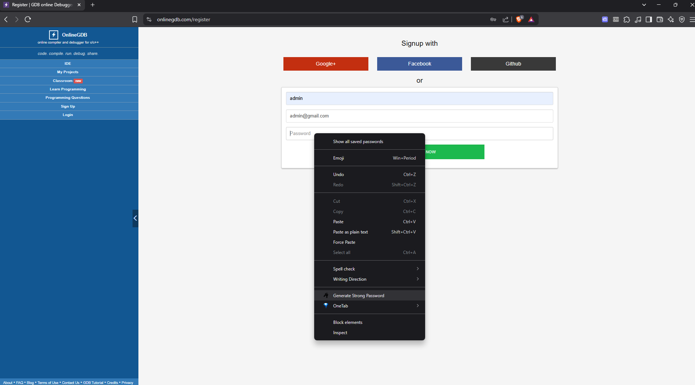
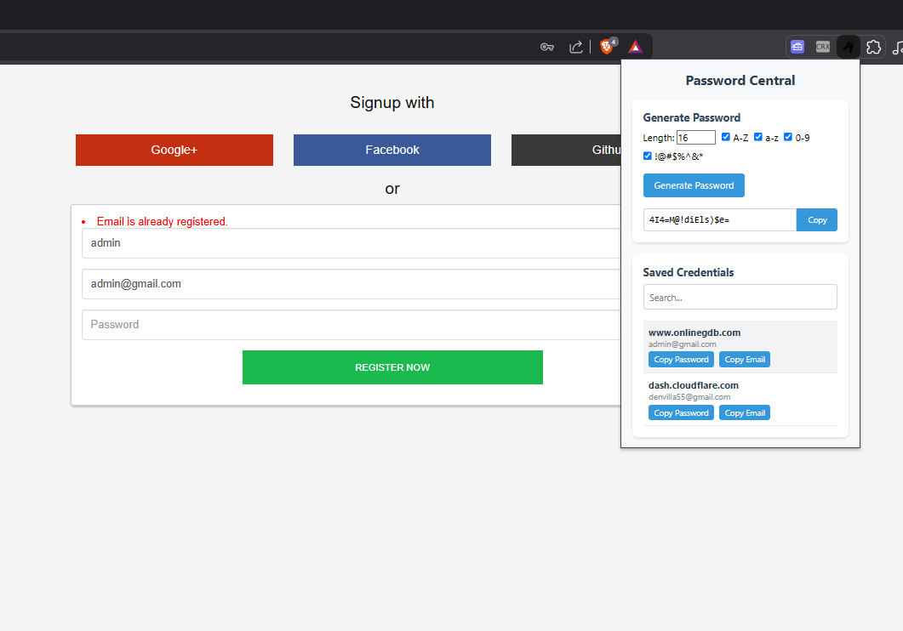
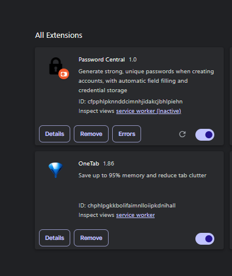
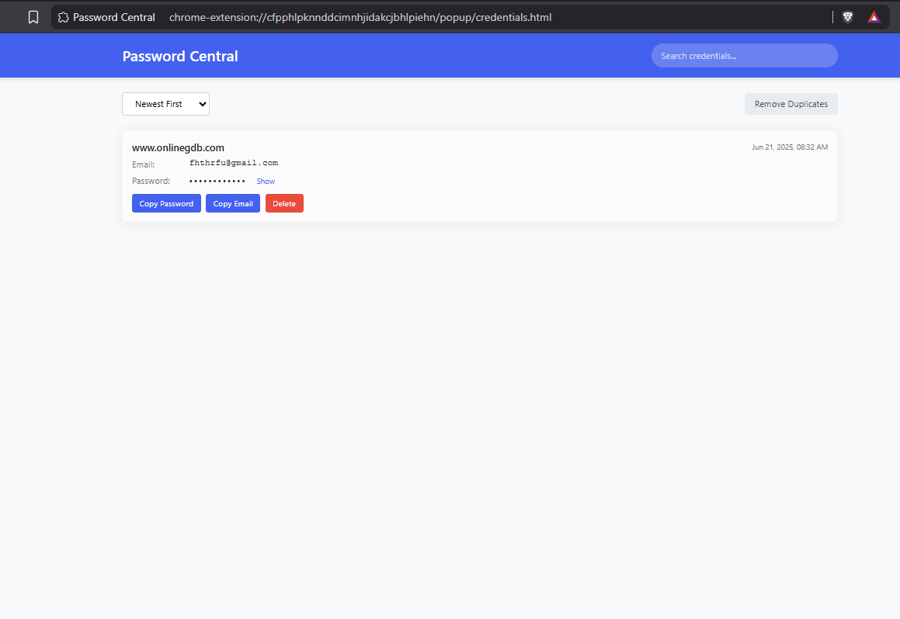

# Password Central Browser Extension

A browser extension that helps you generate strong, unique passwords when creating accounts on websites. With a simple right-click, you can generate a secure password, have it automatically pasted into the selected field, and keep a record of your credentials.

## Why Password Central?

While modern browsers offer built-in password generation features, they're not consistently available on all websites and platforms. Password Central was created to address this limitation by providing a reliable, universal password generation solution that works across any website. Additionally, it offers enhanced credential management features not commonly found in browser-native solutions.

## Features

- **Right-Click Password Generation**: Generate a strong password directly from the context menu
- **Auto-paste**: Automatically paste the generated password into the selected field
- **Enhanced Password Field Detection**: Intelligently identifies password fields using multiple heuristics
- **Smart Confirm Password Detection**: Automatically fills matching "confirm password" and "re-enter password" fields
- **Credential Storage**: Securely store your usernames, emails, phone numbers, and passwords
- **Password History**: Keep track of all your generated passwords
- **Password Change Support**: Automatically detects password change forms and saves the new credentials
- **Modern Credential Management**: View, search, sort, and manage your saved credentials in a dedicated interface
- **Duplicate Protection**: Intelligent detection and prevention of duplicate credential entries
- **Password Visibility Control**: Toggle password visibility with a simple click
- **Quick Copy Functionality**: Easily copy usernames and passwords to clipboard
- **Search Capabilities**: Quickly find credentials with the search feature
- **Secure by Design**: Your data never leaves your device

## Screenshots

Here are some screenshots showing how Password Central works:

### Context Menu Password Generation

*Right-click on any password field to access the password generation feature*

### Password Auto-Fill

*The generated password is automatically filled into the selected field*

### Credential Management

*The extension in management settings*

### Dedicated Credentials Page

*The dedicated credentials management page for viewing and managing all saved credentials*

### Password Change Detection

*The extension detects password change forms and helps save updated credentials*

## How It Works

1. **Installation**: Install the extension from your browser's extension store (future release) for now just load it as an unpacked extension for development.
2. **Usage**:
   - Right-click on any password field when creating a new account
   - Select "Generate Strong Password" from the context menu
   - The extension will generate a secure password and automatically paste it into the field
   - The extension will automatically detect and fill "confirm password" or "re-enter password" fields
   - After successful account creation, the extension will prompt you to save your credentials
   - View and manage all your saved credentials through the dedicated credentials page
3. **Password Change Support**:
   - When on a password change form (with current password, new password, and confirm new password fields)
   - Right-click on the new password field and select "Generate Strong Password"
   - The extension will generate a password and fill both the new password and confirm password fields
   - When you click "Save new password" on the website, the extension will:
     - Automatically detect the password change action
     - Ask for username/email if the credentials were not previously saved
     - Update existing credentials or save new ones based on the website
     - Allow you to continue with auto-filled credentials on your next visit
4. **Credentials Management**:
   - Click on the extension icon in your browser toolbar
   - Click "View All Credentials" button to open the dedicated credentials management page
   - Search for specific credentials using the search box
   - Sort credentials by website, username, or date
   - Show/hide passwords with the visibility toggle
   - Copy usernames or passwords with a single click
   - Delete unwanted credentials
   - The system automatically prevents duplicate entries by updating existing credentials

## Installation Instructions

### Chrome

1. Download the extension files or clone this repository
2. Open Chrome and navigate to `chrome://extensions/`
3. Enable "Developer mode" by toggling the switch in the top-right corner
4. Click "Load unpacked" and select the extension directory
5. The extension should now appear in your browser toolbar

### Firefox

1. Download the extension files or clone this repository
2. Open Firefox and navigate to `about:debugging#/runtime/this-firefox`
3. Click "Load Temporary Add-on" and select the `manifest.json` file
4. The extension should now appear in your browser toolbar

## Development

### Project Structure

```
password-central/
│
├── manifest.json           # Extension configuration
├── background.js           # Background script for event handling
├── popup/                  # User interface for the extension
│   ├── popup.html          # Popup HTML
│   ├── popup.css           # Popup styling
│   ├── popup.js            # Popup functionality
│   ├── credentials.html    # Credentials management page
│   ├── credentials.css     # Credentials page styling
│   └── credentials.js      # Credentials page functionality
├── content/                # Content scripts
│   └── content.js          # Script injected into web pages
├── icons/                  # Extension icons
│   ├── icon16.png
│   ├── icon48.png
│   └── icon128.png
└── storage/                # Password storage functionality
    └── storage.js          # Handles secure storage of credentials
```

### Building the Extension

1. Make sure you have [Node.js](https://nodejs.org/) installed
2. Install dependencies: `npm install`
3. Build the extension: `npm run build`

## Security Considerations

- All passwords are generated locally on your device
- Credentials are encrypted before being stored
- The extension requires minimal permissions
- Regular security audits are performed
- Duplicate credential prevention helps maintain data integrity
- No credential data is transmitted externally

## Privacy Policy

This extension does not collect or transmit any personal data. All generated passwords and stored credentials remain on your device and are encrypted.

## Contributing

Contributions are welcome! Please feel free to submit a Pull Request.

## License

This project is licensed under the MIT License - see the LICENSE file for details.
